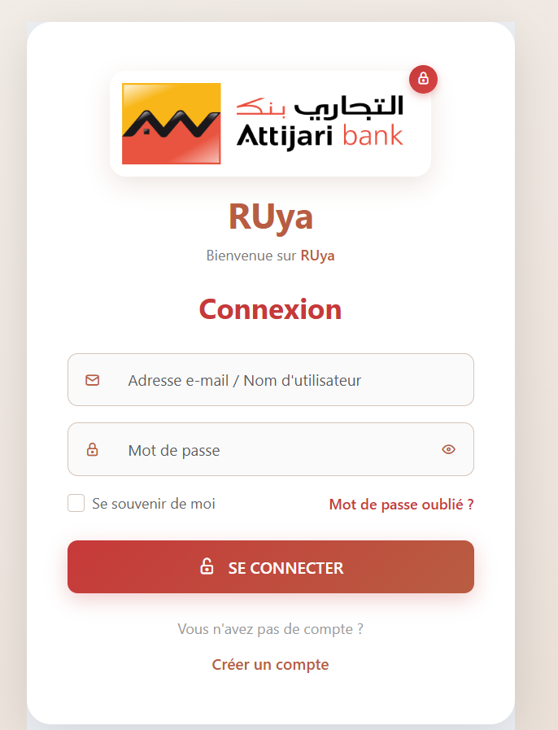
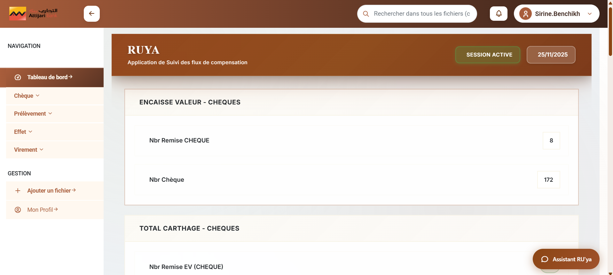
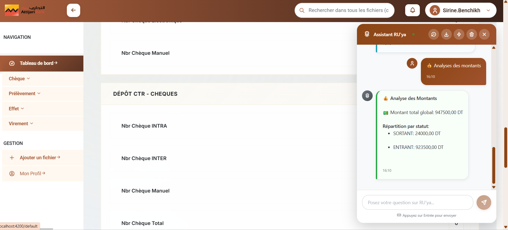
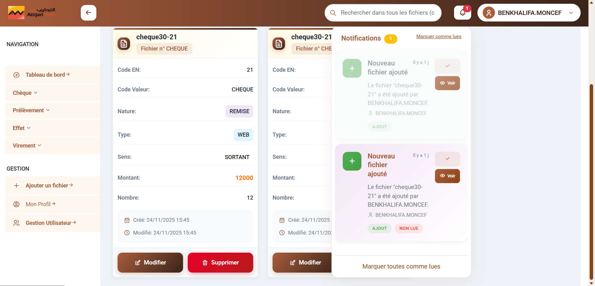
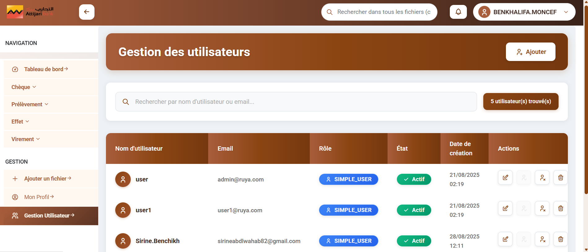

# RUya - Application de Suivi des Flux de Compensation

Application bancaire développée pour Attijari Bank permettant le suivi et la gestion des flux de compensation (chèques, effets, virements, prélèvements).

## 📋 Table des Matières

- [Description](#description)
- [Fonctionnalités](#fonctionnalités)
- [Technologies Utilisées](#technologies-utilisées)
- [Captures d'écran](#captures-décran)
- [Installation](#installation)
- [Structure du Projet](#structure-du-projet)
- [Licence](#licence)

## Description

RUya est une application web complète développée pour Attijari Bank qui permet de gérer et suivre les flux de compensation bancaire. L'application offre une interface moderne et intuitive pour la gestion des différents types de transactions financières.

## Fonctionnalités

### 🔐 Authentification et Gestion des Utilisateurs
- Inscription et connexion sécurisées
- Gestion des profils utilisateurs (Admin et Simple User)
- Système de rôles et permissions

### 📊 Tableau de Bord
- Vue d'ensemble des flux de compensation
- Statistiques en temps réel
- Indicateurs de performance (Encaisse valeur, Total carthage, Dépôt CTR)
- Assistant RUya intégré avec chatbot

### 💰 Gestion des Transactions
- **Chèques** : Suivi des chèques (remise, manuels, INTRA, INTER)
- **Effets** : Gestion des effets de commerce
- **Virements** : Traitement des virements
- **Prélèvements** : Gestion des prélèvements automatiques

### 📄 Gestion des Fichiers
- Ajout et modification de fichiers
- Liste et visualisation des fichiers
- Système de notification en temps réel

### 👥 Administration
- Gestion complète des utilisateurs
- Attribution des rôles (Admin/Simple User)
- Activation/désactivation des comptes
- Historique des actions

### 🔔 Notifications
- Système de notifications en temps réel
- Notifications pour les nouveaux fichiers ajoutés
- Actions de suivi (Marquer comme lu, Voir détails)

## Technologies Utilisées

### Backend
- **Java** avec Spring Boot
- **Maven** pour la gestion des dépendances
- API RESTful
- Base de données (configuration dans `application.properties`)

### Frontend
- **Angular** (Framework TypeScript)
- **SCSS** pour le styling
- **Bootstrap** pour le design responsive
- **Tabler Icons** et **Phosphor Icons**

### Outils de Développement
- Node.js et npm
- Angular CLI
- ESLint pour la qualité du code

## Captures d'écran

### Connexion

*Interface de connexion sécurisée avec option "Se souvenir de moi"*

### Inscription

*Formulaire d'inscription avec validation des champs*

### Tableau de Bord

*Vue d'ensemble des flux de compensation avec l'Assistant RUya*

### Assistant RUya (Chatbot)

*Assistant intelligent pour l'analyse des montants et le support utilisateur*

### Profil Utilisateur

*Page de profil avec informations détaillées (Admin)*

### Notifications

*Système de notifications en temps réel pour les nouveaux fichiers*

### Gestion des Utilisateurs

*Interface d'administration pour la gestion des utilisateurs*

## Installation

### Prérequis
- Java JDK 11 ou supérieur
- Node.js (v14 ou supérieur)
- Maven
- Angular CLI

### Backend (Spring Boot)

```bash
# Naviguer vers le dossier backend
cd RUya_backend

# Installer les dépendances et compiler
mvnw clean install

# Lancer l'application
mvnw spring-boot:run
```

L'API sera accessible sur `http://localhost:8080`

### Frontend (Angular)

```bash
# Naviguer vers le dossier frontend
cd Ruya_frontend

# Installer les dépendances
npm install

# Lancer le serveur de développement
ng serve
```

L'application sera accessible sur `http://localhost:4200`

## Structure du Projet

```
RUya/
├── RUya_backend/           # Application Spring Boot
│   ├── src/
│   │   ├── main/
│   │   │   ├── java/
│   │   │   │   └── tn/esprit/
│   │   │   └── resources/
│   │   │       └── application.properties
│   ├── pom.xml
│   └── mvnw
│
└── Ruya_frontend/          # Application Angular
    ├── src/
    │   ├── app/
    │   │   ├── demo/
    │   │   │   ├── dashboard/
    │   │   │   ├── cheque/
    │   │   │   ├── effet/
    │   │   │   ├── virement/
    │   │   │   ├── prlv/
    │   │   │   └── pages/
    │   │   ├── models/
    │   │   ├── services/
    │   │   └── theme/
    │   ├── assets/
    │   └── environments/
    ├── angular.json
    └── package.json
```

## Fonctionnalités Clés

### Dashboard Interactif
- Visualisation des données en temps réel
- Graphiques et statistiques
- Assistant RUya avec intelligence artificielle

### Système de Fichiers
- Upload et gestion de fichiers
- Catégorisation par type (Chèque, Effet, Virement, etc.)
- Suivi des modifications

### Gestion Multi-Rôles
- **Admin** : Accès complet à toutes les fonctionnalités
- **Simple User** : Accès limité aux fonctionnalités de consultation

### Notifications en Temps Réel
- Alertes pour les nouveaux fichiers
- Notifications de modifications
- Système de marque comme lu

## Configuration

### Backend Configuration
Fichier `application.properties` :
```properties
# Configuration de la base de données
# Configuration du serveur
# Configuration de sécurité
```

### Frontend Configuration
Fichier `environment.ts` :
```typescript
export const environment = {
  production: false,
  apiUrl: 'http://localhost:8080/api'
};
```

## Contributeurs

- **Développement** : Équipe de développement Attijari Bank
- **Design** : Interface utilisateur personnalisée pour Attijari Bank

## Licence

© 2025 Attijari Bank - Tous droits réservés

---

**Note** : Cette application est développée exclusivement pour Attijari Bank et son utilisation est soumise aux politiques internes de la banque.
